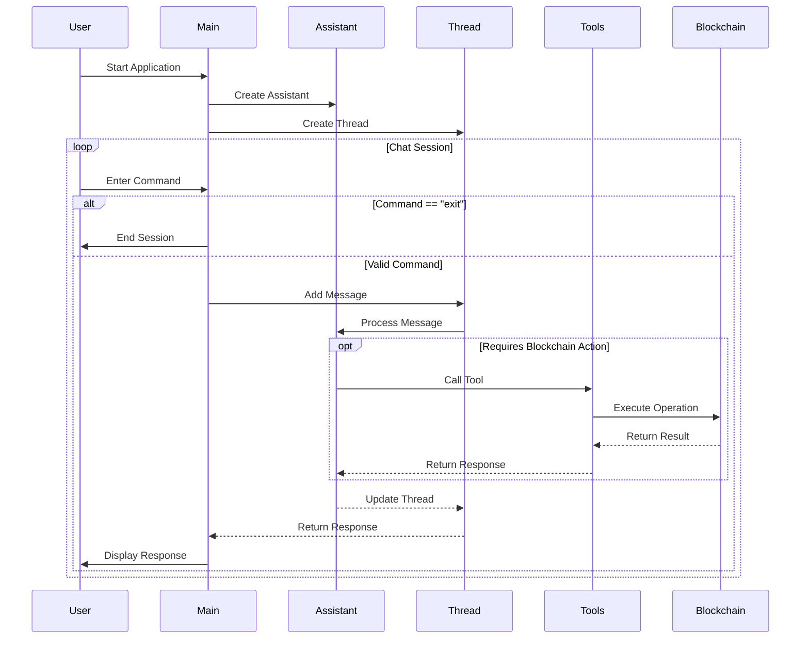

# ScrAIll

## Description

**ScrAIll** is a powerful AI wallet designed to interact with [Scroll network](https://www.scroll.io/). It provides a conversational interface for users to perform various blockchain operations, such as checking wallet balances, sending transactions, and more. 

## What is the problem?
Blockchain networks have brought many new opportunities to millions (if not billions) of people, but the problem lies in the interaction, since Web3 has not managed to popularize such opportunities because it is complex to use for non-technical users (managing wallets, signing transactions, many approvals before spending, among others).

AI appears as an opportunity not only to reach non-technical users, but also to reduce the time and steps for each interaction, that is, to do a lot with few instructions.

## ScrAIll was born to solve this problem
There are already many frameworks designed to connect AI agents to Blockchain, but ScrAIll goes one step further, with the following features:
- Lightweight, with few dependencies needed.
- Focused on the Scroll ecosystem (already integrated with some protocols and extensible in a few steps).
- Ability to execute several on-chain actions with a single instruction (for example: "swap 0.3 USDC to ETH and then use that ETH to send it to 0x....").


## Features

- **Conversational Interface**: Engage with the assistant to perform blockchain operations through natural language.
- **Wallet Operations**: Check wallet balances, last transactions, retrieve connected wallet addresses, and more.
- **Transaction Management**: Send transactions (coins and tokens) with customizable parameters.
- **Trading Management**: Ask for prices and make swaps using [0x Swap API](https://0x.org/).
- **Error Handling**: Robust error handling and feedback for failed operations.

## Getting Started

### Prerequisites

- Node.js (version 14 or higher)
- TypeScript
- [OpenAI API key](https://platform.openai.com/) to enable the AI agent.
- [0x API Key](https://dashboard.0x.org/create-account) to query prices and swaps.
- [Alchemy API Key](https://alchemy.com/) to query wallet transactions and balances.

### Installation

1. Clone the repository:

   ```bash
   git clone https://github.com/nescampos/scraill.git
   cd scraill
   ```

2. Install dependencies:

   ```bash
   bun install
   ```

3. Set up environment variables:
   Create a `.env` file in the root directory and add your OpenAI API key, wallet key file and other information for the network:
   ```plaintext
    OPENAI_API_KEY=************ enter your OpenAI key here
    WALLET_PRIVATE_KEY=**************** enter your wallet private key here (without the "0x" part, just the rest)
    ASSISTANT_NAME=******************* a name for your AI assistant
    ZeroX_API_KEY=************** enter the api key from 0x
    ALCHEMY_API_KEY=********** enter your api key from Alchemy.com
   ```

### Usage

To start the assistant, run:

```bash
bun run src/index.ts
```

You can then interact with the assistant in the command line. Type "exit" to end the conversation.

## Codebase Flow

The following sequence diagram illustrates the core flow of the application:



### Diagram Explanation

The sequence diagram above shows the interaction flow between different components:

1. **Initialization**:
   - ScrAIll starts with creating an OpenAI Assistant
   - A new Thread is created for the conversation

2. **Chat Session Loop**:
   - User enters commands through the CLI
   - Commands are processed through the Thread and Assistant
   - For blockchain operations in Scroll, specific Tools are called
   - Results are returned through the chain of components

3. **Blockchain Integration**:
   - Tools interface with the blockchain through typescript sdks client
   - Operations are executed on the Scroll network
   - Results are propagated back to the user

4. **Session Management**:
   - Users can exit the application at any time
   - Each command is processed in a sequential manner
   - Responses are displayed back to the user


## Contributing

Contributions are welcome! Please open an issue or submit a pull request for any enhancements or bug fixes.

## License

This project is licensed under the MIT License. See the [LICENSE](LICENSE) file for details.